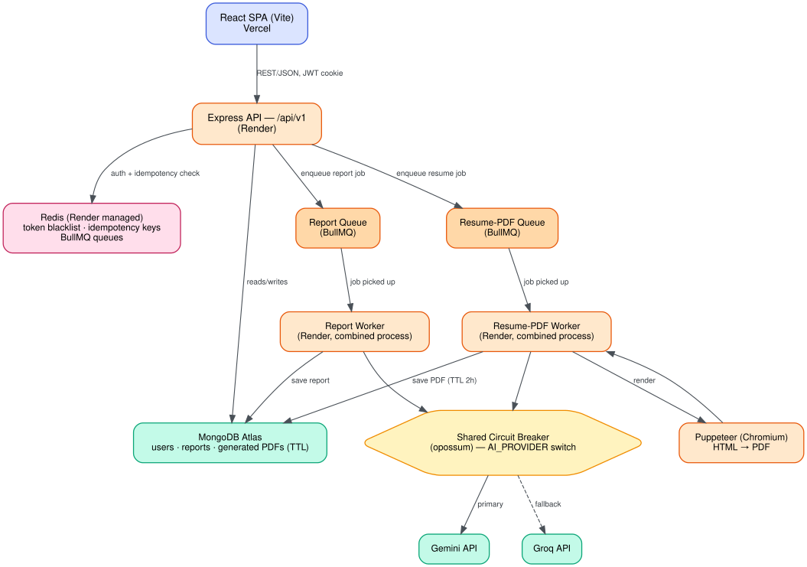
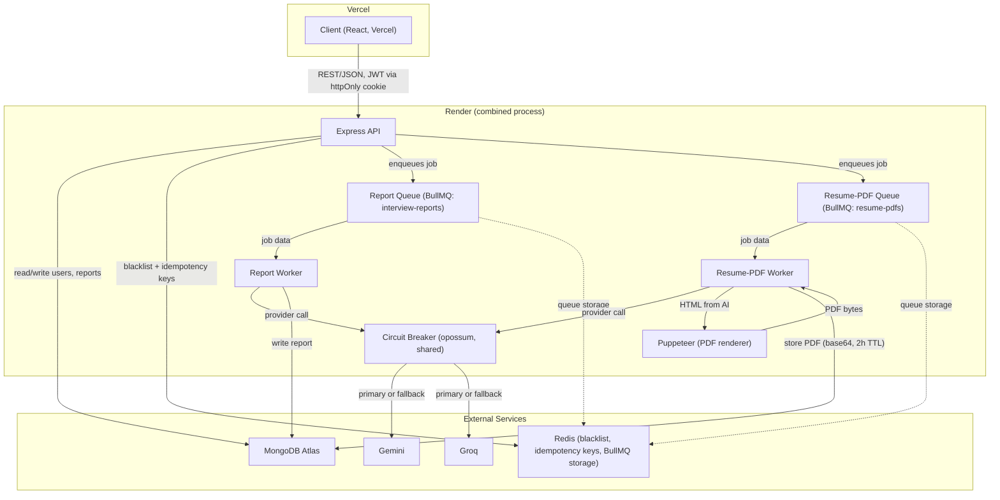

# Architecture

## System Overview

The frontend (React, deployed on Vercel) talks to an Express API (deployed on Render) over REST/JSON, authenticating via an httpOnly JWT cookie. The API persists users and interview reports in MongoDB Atlas. The two expensive operations — interview-report generation and resume-PDF generation — are never done inline on the request: the API validates the request, enqueues a BullMQ job on one of two independent queues, and returns `202 Accepted` immediately. Two workers (one per queue) pull jobs off Redis, call an AI provider (Gemini or Groq) through a shared circuit breaker, and write the result back to MongoDB. Redis serves three distinct purposes here: the BullMQ queue backing store, JWT blacklist for logout, and idempotency-key storage for both job-submission endpoints.

In the current free-tier deployment, both workers run in-process inside the same Render service as the API (env-var-gated at startup) rather than as separate services — see "Why workers run separate locally but combined in deployment" below.

The diagram above shows the deployed topology. The Mermaid version below is the same architecture at component level — useful if you're viewing this file somewhere the PNG doesn't load, or want the exact edge semantics (e.g. which calls are synchronous vs. which just enqueue a job).

## Request Lifecycle: Interview Report Generation

1. **Client → API**: `POST /api/v1/interview/` with the resume file (PDF, required) plus a job description and self description, each as either typed text or an uploaded PDF. Requires an authenticated session (JWT cookie) and an `Idempotency-Key` header.
2. **API**: extracts text from any uploaded PDFs, validates that a job description and self description are present in some form, and atomically claims the idempotency key in Redis (`SET ... EX ... NX`). If the key is already claimed, the API returns the previously-issued `jobId` (if completed) or a `409` (if still in progress) without enqueuing a second job.
3. **API → Report Queue**: on a successful claim, the API enqueues a job (`enqueueInterviewReportJob`) onto the `interview-reports` BullMQ queue and immediately responds `202 { message, jobId }`.
4. **Report Worker**: picks up the job, calls the AI provider abstraction (`generateInterviewReport`) through the shared circuit breaker. On success, it creates an `interviewReport` document in MongoDB scoped to the requesting user.
5. **Client polling**: the client polls `GET /api/v1/interview/status/:jobId` until `state` is `completed` (or `failed`), then fetches the full report via `GET /api/v1/interview/report/:interviewId`. Both lookups are scoped to `{ _id/jobId, user: req.user.id }` — a job or report belonging to another user returns a plain `404`, never a distinguishable "forbidden."

## Request Lifecycle: Resume-PDF Generation

1. **Client → API**: `POST /api/v1/interview/resume-pdf/:reportId`, with an `Idempotency-Key` header, referencing a previously-generated interview report.
2. **API**: looks up the report scoped to the current user (`{ _id: reportId, user: req.user.id }`); a report that doesn't exist or belongs to someone else returns `404` before anything is enqueued. The idempotency claim here uses a distinct Redis key prefix (`idempotency:resume-pdf:...`) so a report submission and a resume-PDF submission can safely reuse the same raw `Idempotency-Key` value without colliding.
3. **API → Resume-PDF Queue**: enqueues a job (`enqueueResumePdfJob`) onto the separate `resume-pdfs` queue with the report's stored resume/self-description/job-description text, and responds `202 { message, jobId }`.
4. **Resume-PDF Worker**: calls the same AI provider abstraction (`generateResumePdf`) through the same shared circuit breaker to get back tailored HTML, then renders it to PDF via Puppeteer (launched with container-safe flags: `--no-sandbox`, `--disable-dev-shm-usage`, etc.), waiting on `domcontentloaded` rather than network idle since the HTML is fully self-contained. The resulting PDF is base64-encoded and stored as a `generatedResumePdf` document with a 2-hour TTL index.
5. **Client polling**: `GET /api/v1/interview/resume-pdf/status/:jobId`, then `GET /api/v1/interview/resume-pdf/:id` to download the binary PDF once ready. A request for an expired, nonexistent, or someone-else's PDF returns the same `404` regardless of which case it actually is.

## Why These Decisions

- **The IDOR fix**: every report/job/PDF lookup is scoped to `{ _id, user: req.user.id }`, and "not found" and "not yours" are never distinguished in the response. Covered by a dedicated regression suite (`interview.idor.test.js`, plus resume-PDF-specific IDOR cases in `resumePdf.test.js`) so this can't silently regress.
- **BullMQ over something like Kafka**: the workload is simple job queuing with retries/backoff against a single Redis instance the app already depends on for other things (blacklist, idempotency) — no need for a separate streaming platform or its operational overhead.
- **Circuit breaker AND retries**: BullMQ's per-job retry (`attempts: 3`, exponential backoff) handles transient failures on an individual job; the circuit breaker handles *sustained* provider outages by fast-failing new calls instead of letting every queued job burn through its own retries against a provider that's already down.
- **Idempotency keys**: AI calls cost money and take tens of seconds. A client retry or a double-click on submit must not trigger a second paid call — the Redis `SET ... EX ... NX` claim makes the "did we already accept this key" check atomic, closing a real race a plain GET-then-SET has.
- **Two separate queues rather than one queue with two job types**: report generation and resume-PDF generation have independent traffic patterns and failure modes (Puppeteer failures are unrelated to AI failures). Separate queues means separate Redis connections and independent backpressure — a spike in one can't starve the other. They still share the *circuit breaker*, deliberately, since both paths call the same underlying AI providers and a real provider outage should fast-fail both.
- **Workers run separate locally/in Docker Compose, combined in deployment**: independent processes are easier to reason about, restart, and scale individually — that's the default and what local dev and `docker-compose.yml` do (`worker-reports`, `worker-resumes` as their own containers). The current Render free tier doesn't offer a separate background-worker service, so `RUN_WORKER_IN_PROCESS` / `RUN_RESUME_WORKER_IN_PROCESS` env vars optionally start both workers in-process inside the API's `server.js` — an explicit, documented tradeoff for that specific deployment, not the default architecture.
- **AI provider abstraction (Gemini primary, Groq fallback)**: `AI_PRIMARY_PROVIDER` picks the primary provider; the circuit breaker's fallback calls the other provider directly (bypassing the breaker's own stats) once the primary has genuinely tripped. One shared env var and one shared breaker cover both features (report generation and resume-PDF generation) via a `callPrimaryProvider({ type, params })` dispatcher, since opossum binds one breaker instance to exactly one action function.
